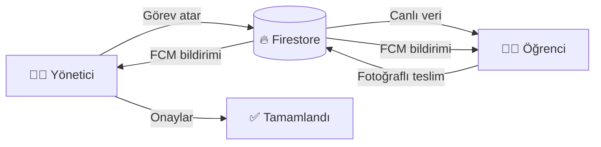

<div align="center">

# 📚 Çoklu Öğrenci Takip Sistemi

### Ödev yönetimi, fotoğraflı teslim, onay ve anlık bildirimler tek uygulamada


</div>

---

Yönetici ödev atar, öğrenci ödevi fotoğrafla gönderir, yönetici onaylar.
Push bildirimleri cihazda düşer ve **dokununca doğrudan ilgili ödevi açar** —
ödevin başlığı, durumu, başlangıç ve son tarihi tek ekranda görünür.

Flutter (mobil) + Firebase (Firestore, Cloud Messaging, Cloud Functions).

**Geliştiren:** Mehmet Gökdeniz

## 🖼️ Uygulama akışı



### Kısa kullanım senaryosu

1. Yönetici öğrenci hesabını oluşturur ve görev tanımlar.
2. Öğrenci takvimden görevini açar, çalışmasını fotoğrafla yükler.
3. Yönetici teslimi inceler ve onaylar.
4. Her iki taraf anlık bildirim alır; bildirime dokununca ilgili görev açılır.

> **Not:** Gerçek Firebase bağlantısı ve uygulama ayarları olmadan APK tam
> işlevli çalışmaz. Kurulum adımları aşağıda ayrıntılı verilmiştir.

---

## İçindekiler

- [Özellikler](#özellikler)
- [Hızlı başlangıç](#hızlı-başlangıç)
- [Bildirim akışı](#bildirim-akışı)
- [Ekranlar](#ekranlar)
- [Veri modeli](#veri-modeli)
- [Yönetici girişi ve güvenlik](#yönetici-girişi-ve-güvenlik)
- [Akıcılık (kasma) notları](#akıcılık-kasma-notları)
- [Proje yapısı](#proje-yapısı)
- [Test ve doğrulama](#test-ve-doğrulama)
- [Bilinen sınırlar](#bilinen-sınırlar)
- [Lisans](#lisans)

---

## Özellikler

- **Yönetici paneli** — öğrenci ekleme/düzenleme/silme, görev atama, fotoğraflı teslimi görüntüleme, onaylama, onaylanan ödevi silme, canlı konum takibi
- **Öğrenci paneli** — aylık takvim görünümü (takvim / tüm görevler modu), gün bazlı filtreleme, fotoğraflı ödev gönderimi
- **Push bildirimleri** — görev atandığında, onaya gönderildiğinde ve onaylandığında; dokununca doğrudan ilgili ödeve açar
- **Kalıcı bildirim geçmişi** — bildirimler Firestore'a da yazılır, cihaz değişse bile kaybolmaz
- **Hakkında ekranı** — uygulama bilgisi ve kullanılan açık kaynaklı kütüphaneler
- **Splash ekranı** — açılışta logo animasyonu, geliştiren bilgisi

---

## Hızlı başlangıç

### Gereksinimler

| Araç | Sürüm |
|---|---|
| Flutter SDK | 3.x (Dart >= 3.0.0) |
| Node.js | 18+ (Cloud Functions ve scriptler için) |
| Firebase CLI | `npm i -g firebase-tools` |
| Android SDK | Flutter'ın önerdiği sürüm |

### 1) Bağımlılıkları kurun

```bash
git clone https://github.com/mehmetgokdeniz/Gorev-Takip.git
cd gorev_takibi

flutter pub get
cd functions && npm install && cd ..
```

### 2) Firebase projenizi bağlayın

```bash
flutterfire configure
```

Bu komut `lib/firebase_options.dart` dosyasını üretir/günceller. Projenizde
Firestore ve Cloud Messaging etkin olmalıdır.

### 3) Gizli ayarları hazırlayın

`.env` dosyaları Git'a **girmaz** (`.gitignore` içinde). Kopyalarını oluşturun:

```bash
# Proje kökü
cp .env.example .env

# Cloud Functions
cp functions/.env.example functions/.env
```

`.env` içindeki `YONETICI_SIFRE_OZET` değerini kendi şifrenize göre üretin:

```bash
node -e "console.log(require('crypto').createHash('sha256').update('YENI_SIFREN','utf8').digest('hex'))"
```

> Orijinal şifre hiçbir yere yazılmaz — sadece bu özet saklanır.
> Şifrenizi unutursanız Functions üzerinden sıfırlamanız gerekir.

`.env` dosyasındaki alanlar:

| Değişken | Nerede kullanılır | Not |
|---|---|---|
| `YONETICI_SIFRE_ADI` | Yalnız yerel sızdıntı taraması | APK'ya **gömülmez** |
| `YONETICI_SIFRE_OZET` | Cloud Functions | Sunucunun beklediği özet |
| `YONETICI_SIFRE_HASH` | APK'ya gömülür | Çevrimdışı yedek, görünür |
| `YONETICI_DOGRULAMA_URL` | APK'ya gömülür | Deploy sonrası doldurulur |
| `FIREBASE_*` | Bilgi amaçlı | `firebase_options.dart`'ta zaten var |
| `GOOGLE_SERVICE_ACCOUNT_*` | Lokal emulator | Canlıda gerekmez |

### 4) Functions'ı deploy edin

```bash
firebase deploy --only functions
```

Deploy sonrası Cloud Function adresini `.env` içine yazın:

```
YONETICI_DOGRULAMA_URL=https://<region>-<proje-id>.cloudfunctions.net/yoneticiSifresiDogrula
```

Ayrıca Firebase Console → Functions → Environment variables bölümüne
aynı `YONETICI_SIFRE_OZET` değerini tanımlayın (canlı ortam `.env`
dosyasını okumaz).

### 5) Derleme

```bash
node scripts/dart_define_uret.js --build
```

Bu komut `.env` içindeki değerleri okur ve `--dart-define` bayraklarını
otomatik ekleyerek release APK'yı üretir. Çıktı:

```
build/app/outputs/flutter-apk/app-release.apk
```

> ⚠️ **Düz `flutter build apk --release` kullanmayın.** `--dart-define`
> bayrağı olmadan derlenen APK'da şifre özeti boş gömülür ve yönetici
> girişi sessizce başarısız olur. Her zaman yukarıdaki script'i kullanın.

### 6) Çalıştırma (geliştirme)

```bash
flutter run
```

---

## Bildirim akışı

| Durum | Kime | `tur` |
|---|---|---|
| Yönetici ödev atadı | Öğrenci | `gorev_atanldi` |
| Öğrenci onaya gönderdi | Yönetici | `onay_bekliyor` |
| Yönetici onayladı | Öğrenci | `onaylandi` |

Her bildirim iki yere yazılır:

1. **Push** — FCM üzerinden anında bildirim
2. **Uygulama içi kayıt** — `{koleksiyon}/{belge}/bildirimler/` altına

İkincisi sayesinde bildirim geçmişi kalıcıdır; cihaz değişse bile liste
korunur ve zil ikonundaki okunmamış rozeti gerçek bir bildirim
sayısından gelir.

**Dokunma davranışı** (`lib/services/bildirim_yonlendirici.dart`):

- Uygulama ön plandayken → sistem bildirimi + SnackBar çıkar, "Aç" ile göreve gidilir
- Arka plandayken dokunuldu → doğrudan görev detayı açılır
- Uygulama kapalıyken dokunuldu → ilk karede otomatik açılır

Hedef ekran `lib/screens/gorev_detay_ekrani.dart`'dir.

> **Aktif kullanıcı şarttır.** Yönlendirici, ekranı açabilmek için
> kimin giriş yaptığını bilmelidir. Giriş sonrası
> `aktifKullaniciyiAyarla()` çağrılır; bu çağrı eksikse bildirime
> dokunulduğunda uygulama "aktif kullanıcı yok" deyip mesajı düşürür
> ve hiçbir ekran açmaz.

### Android bildirim kanalı

Android 8+ her uygulamanın bildirim göndermek için bir kanala ihtiyacı
vardır. Kanal `lib/services/bildirim_servisi.dart` içinde
`kanalKur()` ile, uygulama her açılışta oluşturulur:

```dart
AndroidNotificationChannel(
  'gorev_bildirimleri',
  importance: Importance.high,
)
```

> **Kanal önemi değiştirilemez.** Bir kanal bir kez oluşturulduktan
> sonra `importance` değerini kullanıcı da uygulama da değiştiremez.
> Bu yüzden baştan `high` ile kurulmalıdır — aksi hâlde bildirimler
> sessizce gömülür ve kullanıcı hiçbir şey görmez.

`channelId` değeri `functions/index.js` içindekiyle **birebir aynı**
olmalıdır; iki taraf ayrışırsa bildirimler düşmez.

---

## Akıcılık (kasma) notları

Üç ayrı yerde aynı hata vardı ve düzeltildi. Yeni kod yazarken
bunları tekrarlamamak önemli:

**1. Firestore stream'ini `build()` içinde oluşturmayın.**

```dart
// YANLIŞ — her yeniden çizimde yeni abonelik, eskisi atılır
StreamBuilder<QuerySnapshot<Map<String, dynamic>>>(
  stream: koleksiyon.snapshots(),   // build() gövdesinde

// DOĞRU — bir kez kurulur, ömür boyu saklanır
late final Stream<List<Gorev>> _gorevlerStream;

@override
void initState() {
  super.initState();
  _gorevlerStream = koleksiyon.snapshots().map(...);
}
```

`build()` içinde kurulan stream, gelen veri `setState` tetiklediği
için yeniden çizimi tetikler; bu da yeniden abonelik demektir.

**2. Belgeyi her karede ayrıştırmayın.**

```dart
// YANLIŞ — itemBuilder her çizimde parse eder
final gorev = Gorev.dokumandan(docs[index]);

// DOĞRU — stream tarafında bir kez çözülür
_stream = koleksiyon.snapshots()
    .map((s) => s.docs.map(Gorev.dokumandan).toList());
```

**3. Base64 görselleri `Image.memory` ile çözmeyin.**

```dart
// YANLIŞ — her karede base64Decode
Image.memory(base64Decode(yol))

// DOĞRU — bir kez çöz, önbellekten çiz
OnbellekliGorsel(yol: yol, fit: BoxFit.cover)
```

`lib/services/gorsel_onbellek.dart` çözümü bir kez yapar, `ui.Image`
olarak saklar ve `RawImage` ile çizer. En fazla 200 görsel tutar,
aşanı en eskisi atılır.

---

## Ekranlar

| Ekran | Dosya | Açıklama |
|---|---|---|
| Splash | `screens/splash_ekrani.dart` | Açılış animasyonu, geliştiren bilgisi |
| Giriş | `main.dart` (`GirisEkrani`) | Yönetici (biyometrik/şifre) ve öğrenci girişi |
| Yönetici paneli | `main.dart` (`YoneticiPaneli`) | Öğrenci listesi, ekleme, düzenleme, silme |
| Öğrenci detayı | `main.dart` (`OgrenciDetayPaneli`) | Görev listesi, atama, onaylama, silme |
| Canlı konum | `main.dart` (`CanliKonumPaneli`) | Öğrencinin anlık konumu |
| Öğrenci paneli | `main.dart` (`OgrenciPaneli`) | Takvim + görev listesi, ödev gönderimi |
| Görev detayı | `screens/gorev_detay_ekrani.dart` | Ödev ayrıntısı, onay/gönderim |
| Bildirimler | `screens/bildirimler_ekrani.dart` | Bildirim geçmişi ve filtreler |
| Hakkında | `screens/hakkinda_ekrani.dart` | Uygulama ve kütüphane bilgileri |

---

## Proje yapısı

```
lib/
├── main.dart                       # Giriş ekranı, yönetici paneli, öğrenci paneli
├── firebase_options.dart           # Firebase yapılandırması (üretilmiş)
├── config/
│   ├── uygulama_ayarlari.dart      # Şifre özeti, ortam değişkenleri
│   └── uygulama_bilgisi.dart       # Sürüm, geliştirici, kütüphane listesi
├── models/
│   ├── gorev.dart                  # Görev + durum + tarih aralığı
│   └── bildirim.dart               # Bildirim + türleri
├── services/
│   ├── bildirim_servisi.dart       # Kanal, token kaydı, bildirim listesi
│   ├── bildirim_yonlendirici.dart  # Dokunma → ekran yönlendirmesi
│   └── gorsel_onbellek.dart        # Base64 görsel önbelleği (kasma için)
├── screens/
│   ├── splash_ekrani.dart          # Açılış ekranı
│   ├── hakkinda_ekrani.dart        # Hakkında + kütüphaneler
│   ├── bildirimler_ekrani.dart     # Uygulama içi bildirim listesi
│   └── gorev_detay_ekrani.dart     # Ödev + başlangıç/son tarih
└── widgets/
    └── bildirim_rozeti.dart        # AppBar bildirim düğmesi + rozet

functions/
├── index.js                        # Firestore trigger'ları, bildirim gönderimi
├── sifre_dogrula.js                # Şifre doğrulama (sadece özet karşılaştırır)
├── ortam.js                        # .env okuyucu (bağımlılıksız)
└── .env.example                    # Şablon

scripts/
├── ortam_yardimci.js               # Script'ler için ortak .env okuyucu
├── dart_define_uret.js             # Derleme komutu üretir / derler
├── sifre_testi.js                  # Şifre doğrulama testleri
├── apk_sizinti_taramasi.js         # APK sızıntı taraması
├── functions_kontrol.js            # Trigger varlık kontrolü
└── ikon_uret.js                    # SVG → uygulama ikonu üretir
```

---

## Veri modeli

### `gorevler/{gorevId}`

| Alan | Tip | Açıklama |
|---|---|---|
| `ogrenciId` | string | Öğrenci kimliği |
| `baslik` | string | Ödev başlığı |
| `durum` | string | `atanlandi` / `onay_bekliyor` / `onaylandi` |
| `aciklama` | string | Öğrenci notu |
| `resimYollari` | string[] | Fotoğraflar (base64) |
| `baslangicTarihi` | timestamp | **Başlangıç tarihi** |
| `sonTarih` | timestamp | **Son tarih** |
| `zaman` | timestamp | Oluşturma zamanı |

### `ogrenciler/{ogrenciId}`

`adSoyad`, `profilResmi`, `enlem`, `boylam`, `zaman`

Alt koleksiyonlar: `tokens/` (FCM), `bildirimler/` (geçmiş)

### `ayarlar/yonetici`

Alt koleksiyonlar: `tokens/`, `bildirimler/`

---

## Yönetici girişi

Şifre **hiçbir yerde düz metin saklanmaz**. Akış:

1. Kullanıcı şifreyi yazar
2. Uygulama SHA-256 özetini hesaplar
3. Cloud Function (`yoneticiSifresiDogrula`) özeti **kendi** özetiyle
   karşılaştırır (zamanlama sızıntısına karşı `timingSafeEqual`)
4. HTTP 200 → yönetici, 401 → red

Cloud Function erişilemezse uygulama `--dart-define` ile gömülü özete
düşer (internet yok senaryosu).

**Önemli:** `--dart-define` ile verilen değer APK'nın içine gömülür ve
decompile edildiğinde görünür. Bu yüzden:

- Gerçek sırlar için `--dart-define` **kullanmayın**
- `YONETICI_SIFRE_OZET` yalnızca Functions tarafında tutulur
- Boş bırakılırsa fonksiyon 503 döner ve **kimse** yönetici giremez
  (güvenli varsayılan)

---

## Test ve doğrulama

```bash
flutter analyze                     # statik analiz
flutter test                        # Dart testleri (30 test)
node scripts/sifre_testi.js         # şifre doğrulama (12 kontrol)
node scripts/functions_kontrol.js  # trigger'lar yüklü mü
node scripts/apk_sizinti_taramasi.js  # APK sızıntı taraması
```

Sızıntı taraması iki yönü doğrular:

- Şifre **özeti** APK'da **bulunmalı** (çevrimdışı giriş çalışsın)
- Şifre **metni** APK'da **bulunmamalı**

---

## Git'e göndermeden önce

`.env` dosyaları `.gitignore` içindedir ve commit edilmez. Doğrulamak için:

```bash
git status --short          # .env görünmemeli
git check-ignore -v .env    # hangi kuralın tuttuğunu gösterir
```

Ajan araçlarının hafızası (`.commandcode/`) da ignore edilir; içinde
proje değeri barındırabilir.

---

## Bilinen sınırlar

- **Firestore kuralları kapalı.** `firestore.rules` tüm istemci erişimini
  reddediyor; uygulama yalnızca Firebase Authentication eklendikten sonra
  çalışabilir. Kuralların yorumlu hâli dosyanın içinde hazır bekliyor.
- **Öğrenci girişi kimlik doğrulaması değil.** Öğrenci ID'sini bilen kişi
  o öğrencinin verisine erişir. Gerçek koruma için `firebase_auth` gerekir.
- **Ödev reddi yok.** Yönetici görevi onaylayabilir veya hiçbir işlem
  yapmayabilir; görev `onay_bekliyor` durumunda kalır.
- **Teslim geçmişi tutulmaz.** Ödev gönderimi `gorevler/{id}` belgesinin
  üzerine yazılır; önceki açıklama ve fotoğraflar kalıcı olarak ezilir.
- **Görev durumu elle değiştirilemez.** Durum yalnız uygulama üzerinden
  ilerler; geçmişe dönük düzenleme arayüzü yoktur.
- **APK debug anahtarıyla imzalanır.** `android/key.properties` olmadığı için
  Play Store'a yüklenemez. Kalıcı imza anahtarı üretilmelidir.
- Fotoğraflar Firestore'da base64 olarak saklanır (belge limiti 1 MB).
  Çok fotoğraflı gönderimlerde bu sınıra dikkat edilmelidir.

---

## Lisans

Bu proje [MIT Lisansı](LICENSE) ile lisanslanmıştır.

**Geliştiren:** Mehmet Gökdeniz

Kullanılan tüm bağımlılıklar açık kaynaklıdır ve kendi lisanslarına
tabidir; liste için [Hakkında ekranına](lib/screens/hakkinda_ekrani.dart)
bakabilirsiniz.